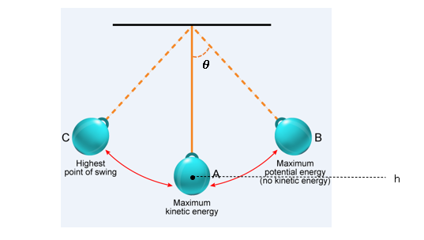
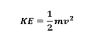
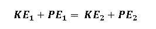

# Theory

## Introduction to the Pendulum System

A pendulum is a fundamental mechanical system characterized by a mass, commonly called the **bob**, suspended from a fixed point via a lightweight and inextensible string or rod. When displaced from its equilibrium position and released, the pendulum undergoes **oscillatory motion** under the influence of gravitational force.

This motion is **periodic** in nature, with energy continuously transforming between **potential energy (PE)** and **kinetic energy (KE)**. At the extremities of its swing, the system's energy is entirely potential due to the maximum height of the bob. Conversely, at the equilibrium position, where the bob attains maximum velocity, the energy is entirely kinetic.

This interplay of energy forms underpins the principles of **conservation of mechanical energy**, making the pendulum a foundational model for studying energy transformations in mechanical systems.

  

---

## Mechanical Energy in a Pendulum

The **total mechanical energy (TME)** of a pendulum represents the sum of its **potential energy (PE)** and **kinetic energy (KE)**, and it remains **constant** in an ideal system without energy losses:

**TME = KE + PE**

### 1. Kinetic Energy (KE)

Kinetic energy is the energy associated with the **motion** of the pendulum bob as it swings. It is given by:

  

Where:
- `m` = mass of the pendulum bob (in kilograms),
- `v` = instantaneous velocity of the pendulum bob (in meters per second).

At the **equilibrium position**, where the velocity of the bob is at its **maximum**, the kinetic energy reaches its **peak value** while potential energy is at its minimum. This represents the point of maximum dynamic energy in the system.

### 2. Potential Energy (PE)

Potential energy is the energy associated with the **position** of the pendulum bob relative to its **lowest point**. It is mathematically expressed as:

**PE = mgh**

Where:
- `m` = mass of the pendulum bob (in kilograms),
- `g` = acceleration due to gravity (9.81 m/s²),
- `h` = vertical height of the bob above the equilibrium point (in meters).

---

## Conservation of Energy

In an ideal mechanical system (i.e., without air resistance or friction), the **total mechanical energy (TME)** of a pendulum remains **constant** throughout its motion.

This total energy is the sum of the **kinetic energy (KE)** and the **potential energy (PE)** of the system:

**TME = KE + PE**

According to the principle of **conservation of energy**, the total mechanical energy at one instant of time is equal to the total mechanical energy at any other instant:

  

Here, points **1** and **2** represent **any two arbitrary instants** during the motion of the pendulum. This implies that although **kinetic** and **potential energies** continuously transform into each other, the **sum remains constant** in the absence of non-conservative forces.

---

# Energy States During Motion

## 1. At the Highest Point of the Swing

The pendulum bob is momentarily at rest (`v = 0`), resulting in:

- **Kinetic Energy (KE)** = 0

The height (`h`) is at its maximum, so:

- **Potential Energy (PE)** = `mgh` (maximum potential energy)

---

## 2. At the Lowest Point of the Swing

The pendulum bob reaches its maximum speed (`v = v_max`), making:

- **Kinetic Energy (KE)** = `(1/2) m v_max²` (maximum kinetic energy)

The height (`h = 0`) is zero, resulting in:

- **Potential Energy (PE)** = 0

---

## 3. At Intermediate Points

As the pendulum oscillates, energy continuously transforms between **kinetic energy (KE)** and **potential energy (PE)**. The total mechanical energy remains **constant**, adhering to:

- **Total Mechanical Energy (TME)** = `KE + PE = constant`

---

# Motion of the Pendulum

For small angular displacements, the motion of a pendulum can be approximated as **simple harmonic motion (SHM)**. The angular displacement of the pendulum bob over time is described by the equation:

  <strong>θ(t) = θ₀ cos(ωt)</strong>

Where:
- `θ(t)` = Angular displacement at time `t` (in radians),
- `θ₀` = Maximum angular displacement or amplitude (in radians),
- `ω` = Angular frequency (in radians per second), given by:

  <strong>ω = √(g / L)</strong>

Where:
- `g` = Acceleration due to gravity (9.81 m/s²),
- `L` = Length of the pendulum (in meters).

---

## Characteristics of the Motion

### 1. Periodicity

The pendulum exhibits **periodic motion**, repeating its oscillation in regular intervals. The time taken for one complete cycle, known as the **period (T)**, is given by:

  <strong>T = 2π / ω = 2π √(L / g)</strong>

This shows that the period is **independent of the mass** of the bob and depends only on the **length of the pendulum** and the **gravitational acceleration**.

---

### 2. Small-Amplitude Approximation

The pendulum's motion closely approximates **simple harmonic motion (SHM)** for small angular displacements (`θ₀ < 15°`). This approximation holds because, at small angles, the trigonometric relationship:

  <strong>sin(θ) ≈ θ</strong> (in radians)

is valid. As the amplitude increases beyond this range, the motion **deviates from SHM** due to the non-linear behavior of `sin(θ)`.

---

## Energy and Motion Relationship

As the pendulum oscillates, the angular displacement varies **sinusoidally** with time, while the energy alternates between **kinetic** and **potential** forms, maintaining a **constant total mechanical energy**.

---
